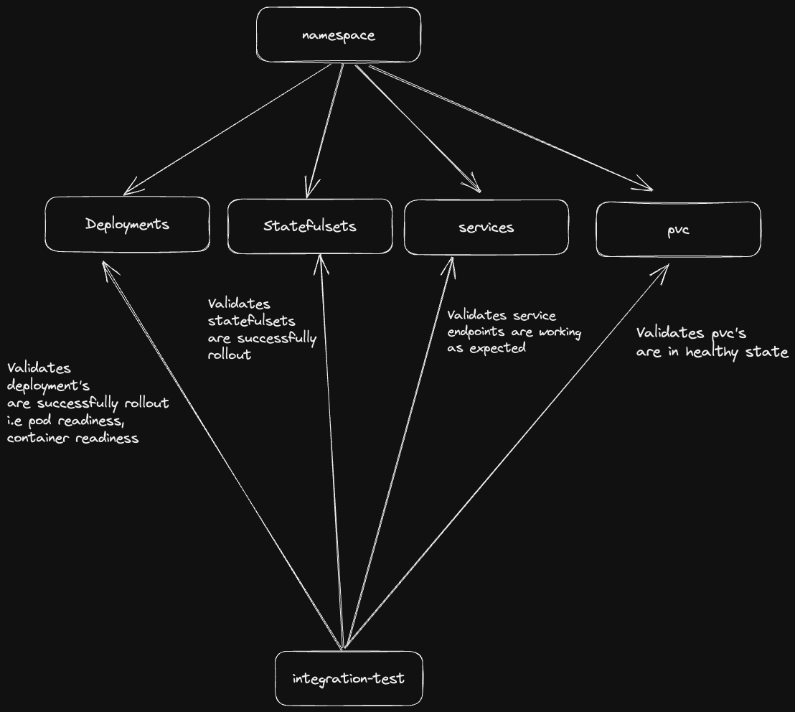

# Integration-Test
A tool that automates the integration testing of your applications on OpenShift/Kubernetes cluster.

## Goals
Currently, we do not have a convenient way to interact with OpenShift/Kubernetes cluster and perform sanity checks on the cluster once our applications are deployed/rollout to the cluster. We need to rely on manual interventions for that.

The tool aims to provide a simple and easy-to-use way for defining such cluster sanity test cases so that we can have checks in place that can provide us correct deployment status of our applications and flag them in case of any failures.

## Features(WIP)
- Intract with OpenShift/Kubernetes cluster via Incluster config or Kubeconfig.
- Validates deployments, statefulsets, services(***Not implemented yet***), pvc's health(***Not implemented yet***) inside the namespace after rollout.
- Validates external network connectivity(***Not implemented yet***).
- Checks API endpoint's used(***Not implemented yet***).
- Validates resource utilization(***Not implemented yet***).

## Design(WIP)

## Usage
```
Usage of ./rhobs-test:
  -interval duration
    	Wait before retry status check again (default 1m0s)
  -kubeconfig string
    	path of kubeconfig file
  -namespaces string
    	List of Namespaces to be monitored (default "default")
  -timeout duration
    	Timeout for retry (default 5m0s)
```
This repository contains Jsonnet configuration that allows generating OpenShift/Kubernetes objects that are required for local testing.

To generate all required files into example/manifests directory run:
```
make manifests
```

To use the integration test automation locally, follow these steps:
- Make sure you have docker or podman installed and running.
- To trigger integration tests against sample manifests run:
  ```
  make local
  ```
  > :point_right: This will install a kind cluster along with the local registry and build a docker image to push to the local registry from where the test job will fetch the image when running on the Kubernetes cluster. This will also take care of deploying service accounts and necessary rbac along with a prometheus-example-app which the integration-test will validate.
- To trigger integration tests against a faulty deployment run:
  ```
  make local-faulty
  ```
  > This can be used in case of negative testing/faulty deployment.

- To destroy the local testing setup run:
  ```
  make clean-local
  ```
## Contributing
If you'd like to contribute to the integration test tool, please fork the repository and create a pull request with your changes.